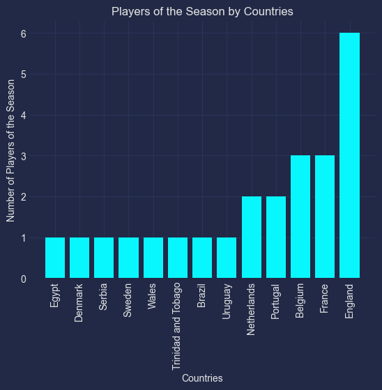

# Premier League

```python
import matplotlib.pyplot as plt
import mplcyberpunk
import pandas

plt.style.use('cyberpunk')
```

```python
champions_data_frame = pandas.read_csv("./champions.csv")
scorers_data_frame = pandas.read_csv("./top-scorers.csv")
players_data_frame = pandas.read_csv("./players-of-the-year.csv")
```

## Top Scorers

```python
unique_scorers_data_frame = scorers_data_frame.filter(items=['name', 'country', 'continent']).drop_duplicates()
unique_scorers_data_frame = unique_scorers_data_frame.sort_values(by = ["continent", "country", "name"])
unique_scorers_data_frame
```

<div>
<style scoped>
    .dataframe tbody tr th:only-of-type {
        vertical-align: middle;
    }

    .dataframe tbody tr th {
        vertical-align: top;
    }

    .dataframe thead th {
        text-align: right;
    }

</style>
<table border="1" class="dataframe">
  <thead>
    <tr style="text-align: right;">
      <th></th>
      <th>name</th>
      <th>country</th>
      <th>continent</th>
    </tr>
  </thead>
  <tbody>
    <tr>
      <th>30</th>
      <td>Mohamed Salah</td>
      <td>Egypt</td>
      <td>Africa</td>
    </tr>
    <tr>
      <th>33</th>
      <td>Pierre-Emerick Aubameyang</td>
      <td>Gabon</td>
      <td>Africa</td>
    </tr>
    <tr>
      <th>18</th>
      <td>Didier Drogba</td>
      <td>Ivory Coast</td>
      <td>Africa</td>
    </tr>
    <tr>
      <th>32</th>
      <td>Sadio Mané</td>
      <td>Senegal</td>
      <td>Africa</td>
    </tr>
    <tr>
      <th>37</th>
      <td>Son Heung-min</td>
      <td>South Korea</td>
      <td>Asia</td>
    </tr>
    <tr>
      <th>22</th>
      <td>Dimitar Berbatov</td>
      <td>Bulgaria</td>
      <td>Europe</td>
    </tr>
    <tr>
      <th>2</th>
      <td>Alan Shearer</td>
      <td>England</td>
      <td>Europe</td>
    </tr>
    <tr>
      <th>1</th>
      <td>Andy Cole</td>
      <td>England</td>
      <td>Europe</td>
    </tr>
    <tr>
      <th>7</th>
      <td>Chris Sutton</td>
      <td>England</td>
      <td>Europe</td>
    </tr>
    <tr>
      <th>5</th>
      <td>Dion Dublin</td>
      <td>England</td>
      <td>Europe</td>
    </tr>
    <tr>
      <th>28</th>
      <td>Harry Kane</td>
      <td>England</td>
      <td>Europe</td>
    </tr>
    <tr>
      <th>34</th>
      <td>Jamie Vardy</td>
      <td>England</td>
      <td>Europe</td>
    </tr>
    <tr>
      <th>11</th>
      <td>Kevin Phillips</td>
      <td>England</td>
      <td>Europe</td>
    </tr>
    <tr>
      <th>6</th>
      <td>Michael Owen</td>
      <td>England</td>
      <td>Europe</td>
    </tr>
    <tr>
      <th>0</th>
      <td>Teddy Sheringham</td>
      <td>England</td>
      <td>Europe</td>
    </tr>
    <tr>
      <th>20</th>
      <td>Nicolas Anelka</td>
      <td>France</td>
      <td>Europe</td>
    </tr>
    <tr>
      <th>13</th>
      <td>Thierry Henry</td>
      <td>France</td>
      <td>Europe</td>
    </tr>
    <tr>
      <th>8</th>
      <td>Jimmy Floyd Hasselbaink</td>
      <td>Netherlands</td>
      <td>Europe</td>
    </tr>
    <tr>
      <th>24</th>
      <td>Robin Van Persie</td>
      <td>Netherlands</td>
      <td>Europe</td>
    </tr>
    <tr>
      <th>14</th>
      <td>Ruud van Nistelrooy</td>
      <td>Netherlands</td>
      <td>Europe</td>
    </tr>
    <tr>
      <th>19</th>
      <td>Cristiano Ronaldo</td>
      <td>Portugal</td>
      <td>Europe</td>
    </tr>
    <tr>
      <th>10</th>
      <td>Dwight Yorke</td>
      <td>Trinidad and Tobago</td>
      <td>North America</td>
    </tr>
    <tr>
      <th>23</th>
      <td>Carlos Tevez</td>
      <td>Argentina</td>
      <td>South America</td>
    </tr>
    <tr>
      <th>27</th>
      <td>Sergio Agüero</td>
      <td>Argentina</td>
      <td>South America</td>
    </tr>
    <tr>
      <th>26</th>
      <td>Luis Suárez</td>
      <td>Uruguay</td>
      <td>South America</td>
    </tr>
  </tbody>
</table>
</div>

### Top Scorers by Continents

```python
top_scorers_continent_series = unique_scorers_data_frame['continent'].value_counts(ascending=True)
top_scorers_continent_series
```

    continent
    Asia              1
    North America     1
    South America     3
    Africa            4
    Europe           16
    Name: count, dtype: int64

```python
plt.bar(top_scorers_continent_series.index, top_scorers_continent_series.values)
plt.xlabel("Continents")
plt.xticks(rotation=90)
plt.ylabel("Number of Top Scorers")
plt.title("Top Scorers by Continents")
plt.show()
```


### Top Scorers by Countries

```python
top_scorers_country_series = unique_scorers_data_frame['country'].value_counts(ascending=True)
top_scorers_country_series
```

    country
    Egypt                  1
    Gabon                  1
    Ivory Coast            1
    Senegal                1
    South Korea            1
    Bulgaria               1
    Portugal               1
    Trinidad and Tobago    1
    Uruguay                1
    France                 2
    Argentina              2
    Netherlands            3
    England                9
    Name: count, dtype: int64

```python
plt.bar(top_scorers_country_series.index, top_scorers_country_series.values)
plt.xlabel("Countries")
plt.xticks(rotation=90)
plt.ylabel("Number of Top Scorers")
plt.title("Top Scorers by Countries")
plt.show()
```


## Players of the Season

```python
unique_players_data_frame = players_data_frame.filter(items=['name', 'country', 'continent']).drop_duplicates()
unique_players_data_frame = unique_players_data_frame.sort_values(by = ["continent", "country", "name"])
unique_players_data_frame
```

<div>
<style scoped>
    .dataframe tbody tr th:only-of-type {
        vertical-align: middle;
    }

    .dataframe tbody tr th {
        vertical-align: top;
    }

    .dataframe thead th {
        text-align: right;
    }

</style>
<table border="1" class="dataframe">
  <thead>
    <tr style="text-align: right;">
      <th></th>
      <th>name</th>
      <th>country</th>
      <th>continent</th>
    </tr>
  </thead>
  <tbody>
    <tr>
      <th>23</th>
      <td>Mohamed Salah</td>
      <td>Egypt</td>
      <td>Africa</td>
    </tr>
    <tr>
      <th>20</th>
      <td>Eden Hazard</td>
      <td>Belgium</td>
      <td>Europe</td>
    </tr>
    <tr>
      <th>25</th>
      <td>Kevin De Bruyne</td>
      <td>Belgium</td>
      <td>Europe</td>
    </tr>
    <tr>
      <th>17</th>
      <td>Vincent Kompany</td>
      <td>Belgium</td>
      <td>Europe</td>
    </tr>
    <tr>
      <th>1</th>
      <td>Peter Schmeichel</td>
      <td>Denmark</td>
      <td>Europe</td>
    </tr>
    <tr>
      <th>0</th>
      <td>Alan Shearer</td>
      <td>England</td>
      <td>Europe</td>
    </tr>
    <tr>
      <th>10</th>
      <td>Frank Lampard</td>
      <td>England</td>
      <td>Europe</td>
    </tr>
    <tr>
      <th>21</th>
      <td>Jamie Vardy</td>
      <td>England</td>
      <td>Europe</td>
    </tr>
    <tr>
      <th>5</th>
      <td>Kevin Phillips</td>
      <td>England</td>
      <td>Europe</td>
    </tr>
    <tr>
      <th>3</th>
      <td>Michael Owen</td>
      <td>England</td>
      <td>Europe</td>
    </tr>
    <tr>
      <th>15</th>
      <td>Wayne Rooney</td>
      <td>England</td>
      <td>Europe</td>
    </tr>
    <tr>
      <th>22</th>
      <td>N'Golo Kanté</td>
      <td>France</td>
      <td>Europe</td>
    </tr>
    <tr>
      <th>6</th>
      <td>Patrick Vieira</td>
      <td>France</td>
      <td>Europe</td>
    </tr>
    <tr>
      <th>9</th>
      <td>Thierry Henry</td>
      <td>France</td>
      <td>Europe</td>
    </tr>
    <tr>
      <th>8</th>
      <td>Ruud van Nistelrooy</td>
      <td>Netherlands</td>
      <td>Europe</td>
    </tr>
    <tr>
      <th>24</th>
      <td>Virgil van Dijk</td>
      <td>Netherlands</td>
      <td>Europe</td>
    </tr>
    <tr>
      <th>12</th>
      <td>Cristiano Ronaldo</td>
      <td>Portugal</td>
      <td>Europe</td>
    </tr>
    <tr>
      <th>26</th>
      <td>Rúben Dias</td>
      <td>Portugal</td>
      <td>Europe</td>
    </tr>
    <tr>
      <th>14</th>
      <td>Nemanja Vidić</td>
      <td>Serbia</td>
      <td>Europe</td>
    </tr>
    <tr>
      <th>7</th>
      <td>Freddie Ljungberg</td>
      <td>Sweden</td>
      <td>Europe</td>
    </tr>
    <tr>
      <th>18</th>
      <td>Gareth Bale</td>
      <td>Wales</td>
      <td>Europe</td>
    </tr>
    <tr>
      <th>4</th>
      <td>Dwight Yorke</td>
      <td>Trinidad and Tobago</td>
      <td>North America</td>
    </tr>
    <tr>
      <th>2</th>
      <td>Juninho</td>
      <td>Brazil</td>
      <td>South America</td>
    </tr>
    <tr>
      <th>19</th>
      <td>Luis Suárez</td>
      <td>Uruguay</td>
      <td>South America</td>
    </tr>
  </tbody>
</table>
</div>

### Players by Continents

```python
players_of_the_season_continent_series = unique_players_data_frame['continent'].value_counts(ascending=True)
players_of_the_season_continent_series
```

    continent
    Africa            1
    North America     1
    South America     2
    Europe           20
    Name: count, dtype: int64

```python
plt.bar(players_of_the_season_continent_series.index, players_of_the_season_continent_series.values)
plt.xlabel("Continents")
plt.xticks(rotation=90)
plt.ylabel("Number of Players of the Season")
plt.title("Players of the Season by Continents")
plt.show()
```


### Players by Countries

```python
players_of_the_season_country_series = unique_players_data_frame['country'].value_counts(ascending=True)
players_of_the_season_country_series
```

    country
    Egypt                  1
    Denmark                1
    Serbia                 1
    Sweden                 1
    Wales                  1
    Trinidad and Tobago    1
    Brazil                 1
    Uruguay                1
    Netherlands            2
    Portugal               2
    Belgium                3
    France                 3
    England                6
    Name: count, dtype: int64

```python
plt.bar(players_of_the_season_country_series.index, players_of_the_season_country_series.values)
plt.xlabel("Countries")
plt.xticks(rotation=90)
plt.ylabel("Number of Players of the Season")
plt.title("Players of the Season by Countries")
plt.show()
```



## Managers

```python
unique_managers_data_frame = champions_data_frame.filter(items=['manager', 'manager_country', 'manager_continent']).drop_duplicates()
unique_managers_data_frame = unique_managers_data_frame.sort_values(by = ["manager_continent", "manager_country", "manager"])
unique_managers_data_frame
```

<div>
<style scoped>
    .dataframe tbody tr th:only-of-type {
        vertical-align: middle;
    }

    .dataframe tbody tr th {
        vertical-align: top;
    }

    .dataframe thead th {
        text-align: right;
    }

</style>
<table border="1" class="dataframe">
  <thead>
    <tr style="text-align: right;">
      <th></th>
      <th>manager</th>
      <th>manager_country</th>
      <th>manager_continent</th>
    </tr>
  </thead>
  <tbody>
    <tr>
      <th>5</th>
      <td>Arsène Wenger</td>
      <td>France</td>
      <td>Europe</td>
    </tr>
    <tr>
      <th>27</th>
      <td>Jürgen Klopp</td>
      <td>Germany</td>
      <td>Europe</td>
    </tr>
    <tr>
      <th>24</th>
      <td>Antonio Conte</td>
      <td>Italy</td>
      <td>Europe</td>
    </tr>
    <tr>
      <th>17</th>
      <td>Carlo Ancelotti</td>
      <td>Italy</td>
      <td>Europe</td>
    </tr>
    <tr>
      <th>23</th>
      <td>Claudio Ranieri</td>
      <td>Italy</td>
      <td>Europe</td>
    </tr>
    <tr>
      <th>19</th>
      <td>Roberto Mancini</td>
      <td>Italy</td>
      <td>Europe</td>
    </tr>
    <tr>
      <th>12</th>
      <td>José Mourinho</td>
      <td>Portugal</td>
      <td>Europe</td>
    </tr>
    <tr>
      <th>0</th>
      <td>Alex Ferguson</td>
      <td>Scotland</td>
      <td>Europe</td>
    </tr>
    <tr>
      <th>2</th>
      <td>Kenny Dalglish</td>
      <td>Scotland</td>
      <td>Europe</td>
    </tr>
    <tr>
      <th>25</th>
      <td>Pep Guardiola</td>
      <td>Spain</td>
      <td>Europe</td>
    </tr>
    <tr>
      <th>21</th>
      <td>Manuel Pellegrini</td>
      <td>Chile</td>
      <td>South America</td>
    </tr>
  </tbody>
</table>
</div>

### Managers by Continents

```python
managers_continent_series = unique_managers_data_frame['manager_continent'].value_counts(ascending=True)
managers_continent_series
```

    manager_continent
    South America     1
    Europe           10
    Name: count, dtype: int64

```python
plt.bar(managers_continent_series.index, managers_continent_series.values)
plt.xlabel("Continents")
plt.xticks(rotation=90)
plt.ylabel("Number of Managers")
plt.title("Managers by Continents")
plt.show()
```


### Managers by Countries

```python
manager_country_series = unique_managers_data_frame['manager_country'].value_counts(ascending=True)
manager_country_series
```

    manager_country
    France      1
    Germany     1
    Portugal    1
    Spain       1
    Chile       1
    Scotland    2
    Italy       4
    Name: count, dtype: int64

```python
plt.bar(manager_country_series.index, manager_country_series.values)
plt.xlabel("Countries")
plt.xticks(rotation=90)
plt.ylabel("Number of Managers")
plt.title("Managers by Countries")
plt.show()
```


