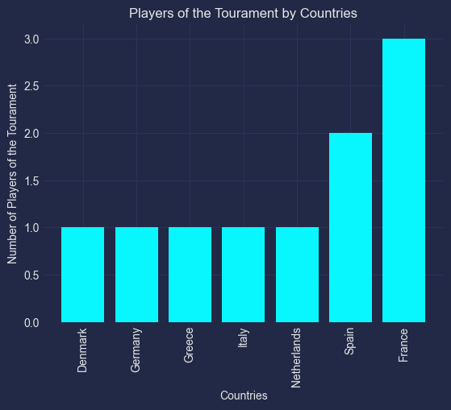
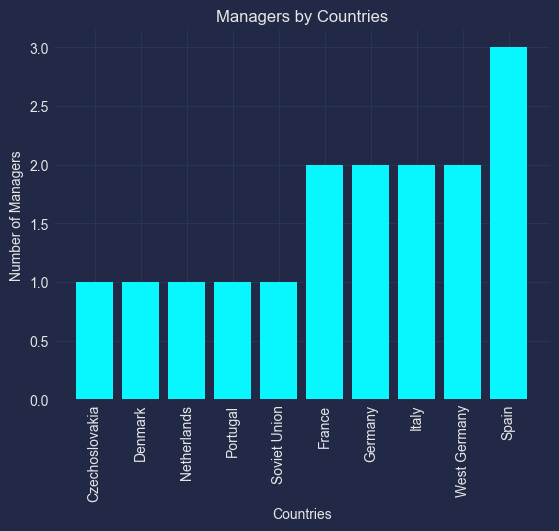

# EURO

```python
import matplotlib.pyplot as plt
import mplcyberpunk
import pandas

plt.style.use('cyberpunk')
```

```python
champions_data_frame = pandas.read_csv("./champions.csv")
scorers_data_frame = pandas.read_csv("./top-scorers.csv")
players_data_frame = pandas.read_csv("./players-of-the-tourament.csv")
```

## Top Scorers

```python
unique_scorers_data_frame = scorers_data_frame.filter(items=['name', 'country']).drop_duplicates()
unique_scorers_data_frame = unique_scorers_data_frame.sort_values(by = ["country", "name"])
unique_scorers_data_frame
```

<div>
<style scoped>
    .dataframe tbody tr th:only-of-type {
        vertical-align: middle;
    }

    .dataframe tbody tr th {
        vertical-align: top;
    }

    .dataframe thead th {
        text-align: right;
    }

</style>
<table border="1" class="dataframe">
  <thead>
    <tr style="text-align: right;">
      <th></th>
      <th>name</th>
      <th>country</th>
    </tr>
  </thead>
  <tbody>
    <tr>
      <th>21</th>
      <td>Milan Baroš</td>
      <td>Czech Republic</td>
    </tr>
    <tr>
      <th>14</th>
      <td>Henrik Larsen</td>
      <td>Denmark</td>
    </tr>
    <tr>
      <th>18</th>
      <td>Alan Shearer</td>
      <td>England</td>
    </tr>
    <tr>
      <th>23</th>
      <td>Antoine Griezmann</td>
      <td>France</td>
    </tr>
    <tr>
      <th>0</th>
      <td>François Heutte</td>
      <td>France</td>
    </tr>
    <tr>
      <th>12</th>
      <td>Michel Platini</td>
      <td>France</td>
    </tr>
    <tr>
      <th>15</th>
      <td>Karl-Heinz Riedle</td>
      <td>Germany</td>
    </tr>
    <tr>
      <th>7</th>
      <td>Deszö Novák</td>
      <td>Hungary</td>
    </tr>
    <tr>
      <th>6</th>
      <td>Ferenc Bene</td>
      <td>Hungary</td>
    </tr>
    <tr>
      <th>16</th>
      <td>Dennis Bergkamp</td>
      <td>Netherlands</td>
    </tr>
    <tr>
      <th>13</th>
      <td>Marco van Basten</td>
      <td>Netherlands</td>
    </tr>
    <tr>
      <th>19</th>
      <td>Patrick Kluivert</td>
      <td>Netherlands</td>
    </tr>
    <tr>
      <th>25</th>
      <td>Cristiano Ronaldo</td>
      <td>Portugal</td>
    </tr>
    <tr>
      <th>2</th>
      <td>Valentin Ivanov</td>
      <td>Soviet Union</td>
    </tr>
    <tr>
      <th>1</th>
      <td>Viktor Ponedelnik</td>
      <td>Soviet Union</td>
    </tr>
    <tr>
      <th>22</th>
      <td>David Villa</td>
      <td>Spain</td>
    </tr>
    <tr>
      <th>24</th>
      <td>Fernando Torres</td>
      <td>Spain</td>
    </tr>
    <tr>
      <th>5</th>
      <td>Jesús María Pereda</td>
      <td>Spain</td>
    </tr>
    <tr>
      <th>17</th>
      <td>Tomas Brolin</td>
      <td>Sweden</td>
    </tr>
    <tr>
      <th>10</th>
      <td>Dieter Müller</td>
      <td>West Germany</td>
    </tr>
    <tr>
      <th>9</th>
      <td>Gerd Müller</td>
      <td>West Germany</td>
    </tr>
    <tr>
      <th>11</th>
      <td>Klaus Allofs</td>
      <td>West Germany</td>
    </tr>
    <tr>
      <th>8</th>
      <td>Dragan Džajić</td>
      <td>Yugoslavia</td>
    </tr>
    <tr>
      <th>3</th>
      <td>Dražan Jerković</td>
      <td>Yugoslavia</td>
    </tr>
    <tr>
      <th>4</th>
      <td>Milan Galić</td>
      <td>Yugoslavia</td>
    </tr>
    <tr>
      <th>20</th>
      <td>Savo Milošević</td>
      <td>Yugoslavia</td>
    </tr>
  </tbody>
</table>
</div>

### Top Scorers by Countries

```python
top_scorers_country_series = unique_scorers_data_frame['country'].value_counts(ascending=True)
top_scorers_country_series
```

    country
    Czech Republic    1
    Denmark           1
    England           1
    Germany           1
    Portugal          1
    Sweden            1
    Hungary           2
    Soviet Union      2
    France            3
    Netherlands       3
    Spain             3
    West Germany      3
    Yugoslavia        4
    Name: count, dtype: int64

```python
plt.bar(top_scorers_country_series.index, top_scorers_country_series.values)
plt.xlabel("Countries")
plt.xticks(rotation=90)
plt.ylabel("Number of Top Scorers")
plt.title("Top Scorers by Countries")
plt.show()
```


## Players of the Tourament

```python
unique_players_data_frame = players_data_frame.filter(items=['name', 'country']).drop_duplicates()
unique_players_data_frame = unique_players_data_frame.sort_values(by = ["country", "name"])
unique_players_data_frame
```

<div>
<style scoped>
    .dataframe tbody tr th:only-of-type {
        vertical-align: middle;
    }

    .dataframe tbody tr th {
        vertical-align: top;
    }

    .dataframe thead th {
        text-align: right;
    }

</style>
<table border="1" class="dataframe">
  <thead>
    <tr style="text-align: right;">
      <th></th>
      <th>name</th>
      <th>country</th>
    </tr>
  </thead>
  <tbody>
    <tr>
      <th>2</th>
      <td>Peter Schmeichel</td>
      <td>Denmark</td>
    </tr>
    <tr>
      <th>8</th>
      <td>Antoine Griezmann</td>
      <td>France</td>
    </tr>
    <tr>
      <th>0</th>
      <td>Michel Platini</td>
      <td>France</td>
    </tr>
    <tr>
      <th>4</th>
      <td>Zinedine Zidane</td>
      <td>France</td>
    </tr>
    <tr>
      <th>3</th>
      <td>Matthias Sammer</td>
      <td>Germany</td>
    </tr>
    <tr>
      <th>5</th>
      <td>Theodoros Zagorakis</td>
      <td>Greece</td>
    </tr>
    <tr>
      <th>9</th>
      <td>Gianluigi Donnarumma</td>
      <td>Italy</td>
    </tr>
    <tr>
      <th>1</th>
      <td>Marco van Basten</td>
      <td>Netherlands</td>
    </tr>
    <tr>
      <th>7</th>
      <td>Andrés Iniesta</td>
      <td>Spain</td>
    </tr>
    <tr>
      <th>6</th>
      <td>Xavi</td>
      <td>Spain</td>
    </tr>
  </tbody>
</table>
</div>

### Players by Countries

```python
players_of_the_tourament_country_series = unique_players_data_frame['country'].value_counts(ascending=True)
players_of_the_tourament_country_series
```

    country
    Denmark        1
    Germany        1
    Greece         1
    Italy          1
    Netherlands    1
    Spain          2
    France         3
    Name: count, dtype: int64

```python
plt.bar(players_of_the_tourament_country_series.index, players_of_the_tourament_country_series.values)
plt.xlabel("Countries")
plt.xticks(rotation=90)
plt.ylabel("Number of Players of the Tourament")
plt.title("Players of the Tourament by Countries")
plt.show()
```



## Managers

```python
unique_managers_data_frame = champions_data_frame.filter(items=['manager', 'manager_country']).drop_duplicates()
unique_managers_data_frame = unique_managers_data_frame.sort_values(by = ["manager_country", "manager"])
unique_managers_data_frame
```

<div>
<style scoped>
    .dataframe tbody tr th:only-of-type {
        vertical-align: middle;
    }

    .dataframe tbody tr th {
        vertical-align: top;
    }

    .dataframe thead th {
        text-align: right;
    }

</style>
<table border="1" class="dataframe">
  <thead>
    <tr style="text-align: right;">
      <th></th>
      <th>manager</th>
      <th>manager_country</th>
    </tr>
  </thead>
  <tbody>
    <tr>
      <th>4</th>
      <td>Václav Ježek\t</td>
      <td>Czechoslovakia</td>
    </tr>
    <tr>
      <th>8</th>
      <td>Richard Møller Nielsen</td>
      <td>Denmark</td>
    </tr>
    <tr>
      <th>6</th>
      <td>Michel Hidalgo</td>
      <td>France</td>
    </tr>
    <tr>
      <th>10</th>
      <td>Roger Lemerre</td>
      <td>France</td>
    </tr>
    <tr>
      <th>9</th>
      <td>Berti Vogts</td>
      <td>Germany</td>
    </tr>
    <tr>
      <th>11</th>
      <td>Otto Rehhagel</td>
      <td>Germany</td>
    </tr>
    <tr>
      <th>2</th>
      <td>Ferruccio Valcareggi</td>
      <td>Italy</td>
    </tr>
    <tr>
      <th>15</th>
      <td>Roberto Mancini</td>
      <td>Italy</td>
    </tr>
    <tr>
      <th>7</th>
      <td>Rinus Michels</td>
      <td>Netherlands</td>
    </tr>
    <tr>
      <th>14</th>
      <td>Fernando Santos</td>
      <td>Portugal</td>
    </tr>
    <tr>
      <th>0</th>
      <td>Gavriil Kachalin</td>
      <td>Soviet Union</td>
    </tr>
    <tr>
      <th>1</th>
      <td>José Villalonga</td>
      <td>Spain</td>
    </tr>
    <tr>
      <th>12</th>
      <td>Luis Aragonés</td>
      <td>Spain</td>
    </tr>
    <tr>
      <th>13</th>
      <td>Vicente del Bosque</td>
      <td>Spain</td>
    </tr>
    <tr>
      <th>3</th>
      <td>Helmut Schön</td>
      <td>West Germany</td>
    </tr>
    <tr>
      <th>5</th>
      <td>Jupp Derwall</td>
      <td>West Germany</td>
    </tr>
  </tbody>
</table>
</div>

### Managers by Countries

```python
manager_country_series = unique_managers_data_frame['manager_country'].value_counts(ascending=True)
manager_country_series
```

    manager_country
    Czechoslovakia    1
    Denmark           1
    Netherlands       1
    Portugal          1
    Soviet Union      1
    France            2
    Germany           2
    Italy             2
    West Germany      2
    Spain             3
    Name: count, dtype: int64

```python
plt.bar(manager_country_series.index, manager_country_series.values)
plt.xlabel("Countries")
plt.xticks(rotation=90)
plt.ylabel("Number of Managers")
plt.title("Managers by Countries")
plt.show()
```


