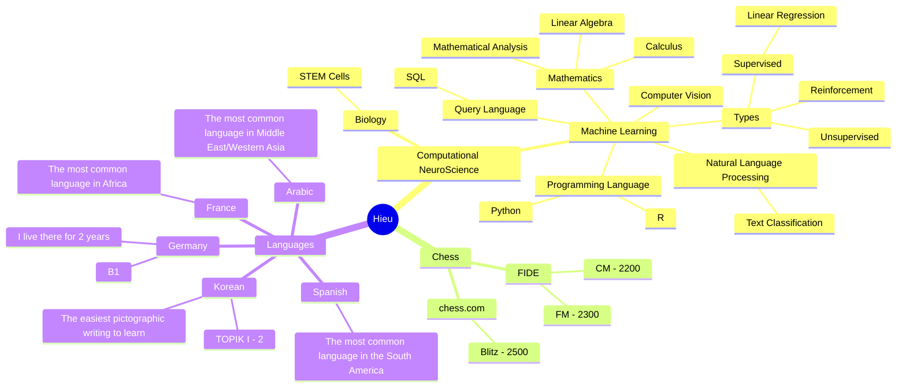

# HIEU

```mermaid
mindmap
  root((Hieu))
    Computational NeuroScience
      Biology
        STEM Cells
      Machine Learning
        Programming Language
          Python
          R
        Query Language
          SQL
        Mathematics
          Linear Algebra
          Calculus
          Mathematical Analysis
        Types
          Supervised
            Linear Regression
          Unsupervised
          Reinforcement
        Natural Language Processing
          Text Classification
        Computer Vision
    Chess
      chess.com
        Blitz - 2500
      FIDE
        CM - 2200
        FM - 2300
    Languages
      Germany
        B1
        I live there for 2 years
      Korean
        TOPIK I - 2
        The easiest pictographic writing to learn
      Spanish
        The most common language in the South America
      France
        The most common language in Africa
      Arabic
        The most common language in Middle East/Western Asia
```
