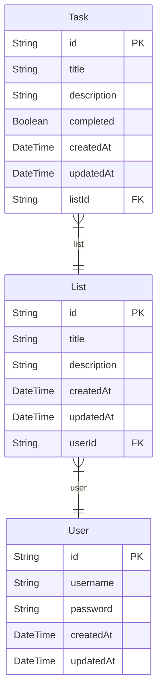

# Prisma Markdown

> Generated by [`prisma-markdown`](https://github.com/samchon/prisma-markdown)

- [default](#default)

## default

### `Task`

**Properties**

- `id`:
- `title`:
- `description`:
- `completed`:
- `createdAt`:
- `updatedAt`:
- `listId`:

### `List`

**Properties**

- `id`:
- `title`:
- `description`:
- `createdAt`:
- `updatedAt`:
- `userId`:

### `User`

**Properties**

- `id`:
- `username`:
- `password`:
- `createdAt`:
- `updatedAt`:
