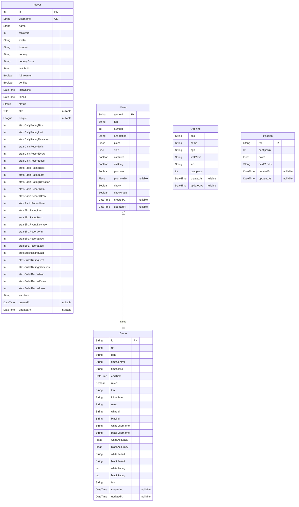

# Prisma Markdown

> Generated by [`prisma-markdown`](https://github.com/samchon/prisma-markdown)

- [default](#default)

## default

### `Player`

**Properties**

- `id`:
- `username`:
- `name`:
- `followers`:
- `avatar`:
- `location`:
- `country`:
- `countryCode`:
- `twitchUrl`:
- `isStreamer`:
- `verified`:
- `lastOnline`:
- `joined`:
- `status`:
- `title`:
- `league`:
- `statsDailyRatingBest`:
- `statsDailyRatingLast`:
- `statsDailyRatingDeviation`:
- `statsDailyRecordWin`:
- `statsDailyRecordDraw`:
- `statsDailyRecordLoss`:
- `statsRapidRatingBest`:
- `statsRapidRatingLast`:
- `statsRapidRatingDeviation`:
- `statsRapidRecordWin`:
- `statsRapidRecordDraw`:
- `statsRapidRecordLoss`:
- `statsBlitzRatingLast`:
- `statsBlitzRatingBest`:
- `statsBlitzRatingDeviation`:
- `statsBlitzRecordWin`:
- `statsBlitzRecordDraw`:
- `statsBlitzRecordLoss`:
- `statsBulletRatingLast`:
- `statsBulletRatingBest`:
- `statsBulletRatingDeviation`:
- `statsBulletRecordWin`:
- `statsBulletRecordDraw`:
- `statsBulletRecordLoss`:
- `archives`:
- `createdAt`:
- `updatedAt`:

### `Game`

**Properties**

- `id`:
- `url`:
- `pgn`:
- `timeControl`:
- `timeClass`:
- `endTime`:
- `rated`:
- `tcn`:
- `initialSetup`:
- `rules`:
- `whiteId`:
- `blackId`:
- `whiteUsername`:
- `blackUsername`:
- `whiteAccuracy`:
- `blackAccuracy`:
- `whiteResult`:
- `blackResult`:
- `whiteRating`:
- `blackRating`:
- `fen`:
- `createdAt`:
- `updatedAt`:

### `Move`

**Properties**

- `gameId`:
- `fen`:
- `number`:
- `annotation`:
- `piece`:
- `side`:
- `captured`:
- `castling`:
- `promote`:
- `promoteTo`:
- `check`:
- `checkmate`:
- `createdAt`:
- `updatedAt`:

### `Opening`

**Properties**

- `eco`:
- `name`:
- `pgn`:
- `firstMove`:
- `fen`:
- `centipawn`:
- `createdAt`:
- `updatedAt`:

### `Position`

**Properties**

- `fen`:
- `centipawn`:
- `pawn`:
- `nextMoves`:
- `createdAt`:
- `updatedAt`:
